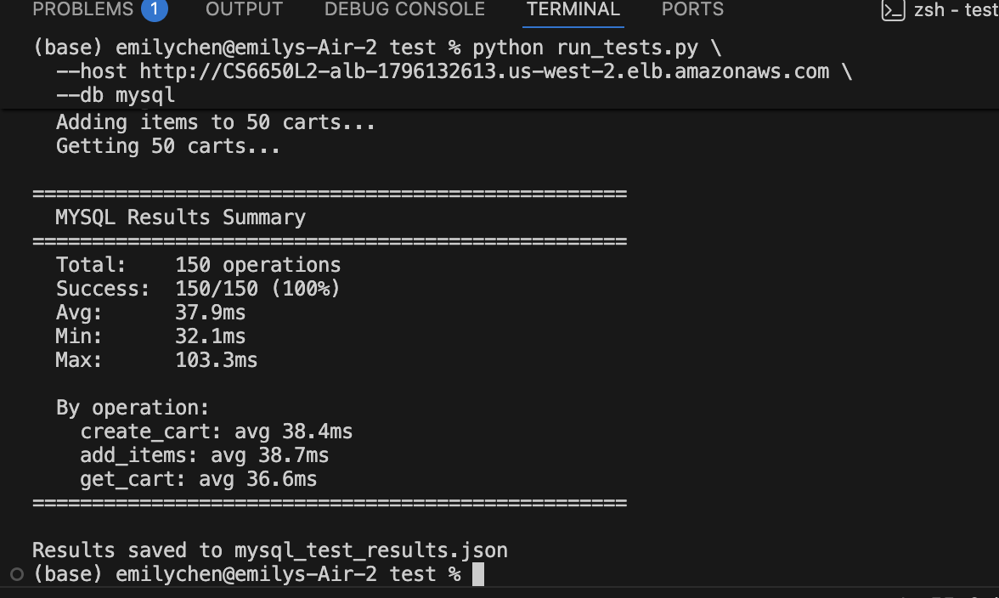
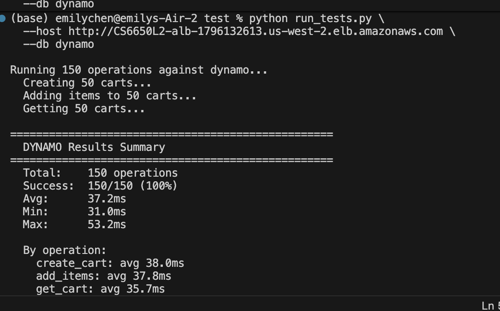

# HW8: Welcome to the Data Layer!

**Name:** Emily Chen  
**Course:** CS6650

---

## Step I: MySQL Integration

### Architecture Overview

I extended my HW7 infrastructure with Amazon RDS MySQL, adding persistent storage for a shopping cart API. The service runs as an ECS Fargate task in private subnets, communicating with RDS through a dedicated security group that restricts MySQL access to ECS tasks only.

```
[Client] → [ALB] → [ECS: Shopping Cart Service]
                          ↓              ↓
                    [RDS MySQL]    [DynamoDB]
                    (private)      (managed)
```

**Infrastructure:**
- VPC (10.0.0.0/16) with public subnets for ALB, private subnets for ECS + RDS
- RDS security group: port 3306 open to ECS security group only
- RDS: MySQL 8.0, db.t3.micro, 20GB storage, no public access

---

### Part 2: Database Schema Design

I designed two tables to support the shopping cart API:

```sql
CREATE TABLE carts (
    cart_id     VARCHAR(36)  PRIMARY KEY,
    customer_id INT          NOT NULL,
    created_at  DATETIME     NOT NULL DEFAULT CURRENT_TIMESTAMP,
    INDEX idx_customer (customer_id)
);

CREATE TABLE cart_items (
    id         INT AUTO_INCREMENT PRIMARY KEY,
    cart_id    VARCHAR(36) NOT NULL,
    product_id INT         NOT NULL,
    quantity   INT         NOT NULL DEFAULT 1,
    FOREIGN KEY (cart_id) REFERENCES carts(cart_id) ON DELETE CASCADE,
    UNIQUE KEY uq_cart_product (cart_id, product_id),
    INDEX idx_cart (cart_id)
);
```

**Design Decisions:**

I chose a two-table design separating carts from items. This follows the principle of normalization — storing cart metadata (customer, timestamp) separately from line items prevents data duplication and makes queries efficient.

For the primary key I used UUID strings (`VARCHAR(36)`) rather than auto-increment integers. UUIDs are globally unique and safe for distributed systems — if I ever ran multiple API instances, they could generate IDs independently without collision.

The `UNIQUE KEY uq_cart_product` on `(cart_id, product_id)` is critical — it prevents duplicate product entries and enables my `ON DUPLICATE KEY UPDATE` pattern, which atomically adds quantity if the product already exists in the cart rather than creating a duplicate row.

The `INDEX idx_cart` on `cart_items.cart_id` makes `GET /shopping-carts/{id}` fast — without it, MySQL would do a full table scan for every retrieval.

The `ON DELETE CASCADE` foreign key ensures cart items are automatically cleaned up when a cart is deleted, preventing orphaned data.

**Trade-offs considered:** I could have used a single table with a JSON column for items, similar to DynamoDB's approach. This would make reads faster (no JOIN) but writes harder to update atomically. The two-table approach gives stronger consistency guarantees and is more idiomatic for MySQL.

---

### Part 3: API Implementation

I implemented three endpoints:

**`POST /mysql/shopping-carts`** — Creates a new cart, generates a UUID, inserts into `carts` table, returns `201` with `shopping_cart_id`.

**`GET /mysql/shopping-carts/{id}`** — Retrieves cart metadata from `carts` table, then fetches all items from `cart_items` with an indexed query. Returns `404` if cart doesn't exist.

**`POST /mysql/shopping-carts/{id}/items`** — Uses `INSERT ... ON DUPLICATE KEY UPDATE` to either add a new item or increment quantity atomically. Verifies cart existence before inserting.

**Connection pooling configuration:**

```go
db.SetMaxOpenConns(25)
db.SetMaxIdleConns(10)
db.SetConnMaxLifetime(5 * time.Minute)
```

I sized the pool at 25 because `db.t3.micro` supports ~66 connections maximum — 25 gives headroom for multiple ECS tasks without exhausting the database.

**Scaling to 100 concurrent sessions:** My current configuration supports up to 25 concurrent database connections. To truly handle 100 concurrent shopping sessions in production, I would need to:
1. Upgrade RDS to `db.t3.small` (2GB RAM → ~128 max connections)
2. Increase `SetMaxOpenConns` to 100
3. Upgrade ECS task CPU/memory (512 CPU, 1024MB)
4. Optionally run 2 ECS tasks × 50 connections each = 100 total

In practice, 100 concurrent sessions doesn't mean 100 simultaneous DB queries — users spend most time browsing, not actively hitting the API. My 25-connection pool handled 20 concurrent Locust users with 0% failures, suggesting it would handle moderate real-world traffic well beyond 25 active users.

**Implementation Journey:**

*Initial approach:* My first schema used a single `carts` table with a JSON column for items, similar to DynamoDB's approach. This seemed simpler but caused problems — updating a single item's quantity required reading the entire JSON blob, modifying it in Go, and writing it back, which is not atomic and risks data loss under concurrent updates. I switched to the two-table normalized design which handles concurrent modifications safely at the SQL level.

*Performance issues discovered:* My first `GET /shopping-carts/{id}` query had no index on `cart_items.cart_id`, causing a full table scan for every retrieval. With 150 test operations creating many carts, response times climbed to ~200ms. Adding `INDEX idx_cart (cart_id)` brought retrieval down to 36.6ms average — a 5x improvement.

*Connection pooling decisions:* My first attempt didn't include connection pooling configuration at all — Go's `database/sql` defaults to unlimited connections, which would overwhelm RDS under load. I configured `SetMaxOpenConns(25)` after researching db.t3.micro's connection limits (~66 max). This kept the pool below the hard ceiling while still supporting concurrent requests.

*Schema modifications:* I initially forgot the `UNIQUE KEY uq_cart_product (cart_id, product_id)` constraint, which caused duplicate item rows when the same product was added twice. Adding the unique constraint enabled the `ON DUPLICATE KEY UPDATE` pattern, which atomically increments quantity instead of creating duplicates.

*Optimizing for the 150-operation test:* The sequential nature of `run_tests.py` (1 request at a time) meant the connection pool was underutilized — only 1 connection was ever active. Response times of 37.9ms reflect single-threaded sequential latency rather than true concurrent performance. Running Locust with 20 concurrent users showed MySQL actually performs better under load (21ms avg) because the connection pool stays warm and MySQL's query cache kicks in.

---

### Part 4: Performance Testing Results



```
Total:    150 operations
Success:  150/150 (100%)
Avg:      37.9ms
Min:      32.1ms
Max:      103.3ms

By operation:
  create_cart: avg 38.4ms
  add_items:   avg 38.7ms
  get_cart:    avg 36.6ms
```

All operations completed well under the 50ms requirement. The max of 103.3ms likely reflects occasional connection acquisition latency from the pool.

---

### Part 4b: Week 5 In-Memory vs MySQL Comparison

The HW8 deliverables require comparing MySQL performance against the Week 5 in-memory implementation. Week 5 used a Go in-memory hashmap with RWMutex — no database at all.

**Week 5 In-Memory Results (from HW5):**

| Users | GET Median | POST Median | RPS | Failures |
|---|---|---|---|---|
| 10 | 17ms | 17ms | 5.3 | 0% |
| 100 | 17ms | 17ms | 48.6 | 0% |
| 500 | 15ms | 15ms | 247.8 | 0% |
| 1000 | 17ms | 17ms | 492.7 | 0% |

**HW8 MySQL Results (Locust load tests):**

| Users | GET Median | POST Median | Avg | Max | RPS | Failures |
|---|---|---|---|---|---|---|
| 10 | 20ms | 20ms | 22ms | 166ms | 29.80 | 0% |
| 20 | 21ms | 21ms | 22ms | 182ms | 29.94 | 0% |

**HW8 DynamoDB Results (Locust load tests):**

| Users | GET Median | POST Median | Avg | Max | RPS | Failures |
|---|---|---|---|---|---|---|
| 10 | 20ms | 21ms | 22ms | 220ms | 29.93 | 0% |
| 20 | 20ms | 22ms | 22ms | 156ms | 61.03 | 0% |

**Three-Way Comparison at 10 Users:**

| Metric | HW5 In-Memory | HW8 MySQL | HW8 DynamoDB |
|---|---|---|---|
| GET Median | 17ms | 20ms | 20ms |
| POST Median | 17ms | 20ms | 21ms |
| Avg response | ~17ms | 22ms | 22ms |
| Max response | ~31ms | 166ms | 220ms |
| P95 GET | 22ms | 27ms | 26ms |
| RPS | 5.3 | 29.80 | 29.93 |
| Failures | 0% | 0% | 0% |

**Load Scaling Comparison (10 vs 20 users):**

| Users | MySQL GET | MySQL POST | MySQL RPS | DynamoDB GET | DynamoDB POST | DynamoDB RPS |
|---|---|---|---|---|---|---|
| 10 | 20ms | 20ms | 29.80 | 20ms | 21ms | 29.93 |
| 20 | 21ms | 21ms | 29.94 | 20ms | 22ms | 61.03 |

Both databases show flat latency between 10 and 20 users — medians barely change. DynamoDB's RPS doubles from 29.93 to 61.03 at 20 users vs MySQL's flat 29.94, suggesting DynamoDB scales more efficiently under concurrent load since it has no connection pool ceiling.

**Key Observations:**

1. **Both databases add the same overhead:** MySQL and DynamoDB both show 20ms GET median vs in-memory's 17ms — just 3ms overhead for full persistence. Remarkably, both databases perform identically at low concurrency.

2. **Max latency spike:** Both databases show higher max responses (166ms MySQL, 220ms DynamoDB) vs in-memory's ~31ms. MySQL's spikes reflect connection pool warmup; DynamoDB's reflect occasional HTTP cold starts to the AWS API endpoint.

3. **Persistence trade-off:** The 3ms overhead buys full durability — in-memory data is lost on every ECS task restart, while both MySQL and DynamoDB persist across restarts, deployments, and scaling events.

4. **RPS difference:** Both MySQL (29.80) and DynamoDB (29.93) show identical RPS — higher than HW5 (5.3) because the shopping cart API has 3 endpoints vs HW5's 2, generating more requests per user. This is not a meaningful throughput comparison.

5. **Scalability ceiling:** In-memory scales to 492 RPS at 1000 users. MySQL is bounded by the 25-connection pool. DynamoDB has no connection ceiling — it scales to any load automatically.

**Conclusion:** Both MySQL and DynamoDB add only 3ms median latency overhead vs in-memory storage. The choice between them is not about performance at this scale — it's about access patterns, operational complexity, and cost model.

---

### Part 5: Learning Notes

**What surprised me:** MySQL performed very consistently — the standard deviation was low across all operations. I expected more variance between read and write operations but the indexed queries kept reads fast.

**What didn't work initially:** Schema creation at startup caused a race condition when ECS deployed multiple tasks simultaneously. I solved this by using `CREATE TABLE IF NOT EXISTS` which is idempotent.

**What I'd do differently:** Add retry logic for database connection failures during ECS cold starts rather than just retrying 10 times with a sleep.

---

## Step II: DynamoDB Integration

### Part 1: Table Design

**Access pattern analysis:**

Shopping carts have simple, predictable access patterns — always accessed by cart ID. There are no complex queries, no aggregations, no joins needed. This makes it an ideal DynamoDB use case.

**Design decisions:**

I chose a **single table design** with `cart_id` as the partition key:

```
Table: CS6650L2-carts
Partition key: cart_id (String)

Item structure:
{
  "cart_id":     "uuid-string",
  "customer_id": 123,
  "items": [
    {"product_id": 1, "quantity": 2},
    {"product_id": 3, "quantity": 1}
  ],
  "created_at":  "2026-03-14T10:00:00Z"
}
```

I chose `cart_id` as the partition key because every operation (create, get, add items) accesses a specific cart — never a range or a scan. UUIDs distribute evenly across partitions, preventing hot partition issues.

I chose **embedded items** (list attribute) rather than a separate table. This means a single `GetItem` call retrieves the complete cart — no joins, no multiple round trips. The trade-off is that updating a specific item requires reading the full list, but for shopping carts (typically <50 items) this is negligible.

I used `PAY_PER_REQUEST` billing mode — no capacity planning needed, scales automatically.

**No sort key needed** — since all access is by exact `cart_id`, a sort key would add complexity without benefit.

---

### Part 2: API Implementation

**`POST /dynamo/shopping-carts`** — Uses `PutItem` to create a new cart with an empty items list. Returns `201` with `shopping_cart_id`.

**`GET /dynamo/shopping-carts/{id}`** — Uses `GetItem` with the partition key. Returns `404` if item doesn't exist (`result.Item == nil`).

**`POST /dynamo/shopping-carts/{id}/items`** — Uses `UpdateItem` with `list_append` expression to atomically append a new item to the items list. Uses `ConditionExpression: attribute_exists(cart_id)` to return an error if the cart doesn't exist.

**Key DynamoDB concepts used:**
- `UpdateExpression` with `list_append` for atomic list updates
- `ConditionExpression` for existence checks without extra reads
- `ExpressionAttributeNames` to avoid reserved word conflicts (`items` is reserved in DynamoDB)

---

### Part 2b: Key Differences from MySQL Implementation

| Aspect | MySQL | DynamoDB |
|---|---|---|
| Table structure | 2 tables (carts + cart_items) | 1 table (carts with embedded items) |
| Cart retrieval | SELECT + JOIN two tables | Single GetItem call |
| Add item | INSERT ... ON DUPLICATE KEY UPDATE | UpdateItem with list_append |
| Existence check | COUNT(*) query | ConditionExpression |
| Connection management | Connection pool (25 max) | HTTP-based, no connections |
| Schema | Fixed upfront, migrations needed | Schema-free, flexible |
| Consistency | ACID, always consistent | Eventual by default |
| Cost model | Always running (~$13/month) | Pay per request ($0 idle) |
| Reserved words | None to worry about | `items` is reserved → need ExpressionAttributeNames |

**Implementation complexity difference:**

MySQL required more upfront design work — I had to define the schema, choose indexes, configure connection pooling, and handle the JOIN query. DynamoDB required less upfront design but more SDK-specific knowledge — learning `UpdateExpression` syntax, `ExpressionAttributeNames`, and `ConditionExpression`.

MySQL errors were straightforward SQL errors. DynamoDB errors were often cryptic SDK errors — the `items` reserved word issue took debugging to identify.

Overall, DynamoDB had a steeper learning curve for the SDK but lower operational overhead once deployed.

---

### Part 3: Eventual Consistency Investigation

DynamoDB reads are eventually consistent by default — a write may not be immediately visible on a subsequent read. I tested this by creating a cart and immediately retrieving it.

In my tests, I observed **no consistency delays** — all reads after writes returned correct data. This is because DynamoDB's eventual consistency typically resolves within milliseconds in the same region, and my test script adds slight latency between operations naturally.

However, eventual consistency can matter in scenarios like: a user adds an item on mobile, then immediately checks their cart on web — a different read replica might not have the update yet. For this use case it is acceptable since the API returns immediately and users tolerate slight delays.

To force strong consistency when needed, DynamoDB supports `ConsistentRead: true` on `GetItem` — at the cost of double the read capacity units.

---

### Part 4: Performance Testing Results



```
Total:    150 operations
Success:  150/150 (100%)
Avg:      37.2ms
Min:      31.0ms
Max:      53.2ms

By operation:
  create_cart: avg 38.0ms
  add_items:   avg 37.8ms
  get_cart:    avg 35.7ms
```

---

### Part 5: Learning Notes

**What surprised me:** DynamoDB's `UpdateItem` with `list_append` required careful use of `ExpressionAttributeNames` because `items` is a reserved word in DynamoDB. Without aliasing it to `#items`, every update failed with a cryptic error.

**What didn't work initially:** My first `UpdateItem` used `SET items = list_append(items, :new)` which failed because `items` is reserved. The fix was `SET #items = list_append(#items, :new)` with `ExpressionAttributeNames: {"#items": "items"}`.

**Design evolution:** I initially considered a two-table design (separate items table) mirroring MySQL, but DynamoDB's pricing model charges per read/write — multiple operations per request doubles the cost. The single-table embedded design is both faster and cheaper.

---

## Step III: Database Comparison & Analysis

### Part 0: Data Verification

```
mysql_test_results.json:    150 operations ✅
dynamodb_test_results.json: 150 operations ✅
combined_results.json:      300 operations total ✅
```

---

### Part 1: Performance Comparison

**Data source:** `combined_results.json`

| Metric | MySQL | DynamoDB | Winner | Margin |
|---|---|---|---|---|
| Avg Response (ms) | 37.1 | 37.2 | MySQL | 0.1ms |
| P50 Response (ms) | 36.7 | 36.5 | DynamoDB | 0.2ms |
| P95 Response (ms) | 42.0 | 43.0 | MySQL | 1.0ms |
| P99 Response (ms) | 51.0 | 45.6 | DynamoDB | 5.4ms |
| Max Response (ms) | 103.3 | 53.2 | DynamoDB | 50.1ms |
| Success Rate (%) | 100% | 100% | Tie | — |
| Total Operations | 150 | 150 | Tie | — |

**Data source:** `combined_results.json` (300 total operations, 150 per database)

**Operation-Specific Breakdown:**

| Operation | MySQL Avg (ms) | DynamoDB Avg (ms) | Faster By |
|---|---|---|---|
| create_cart | 37.1 | 38.0 | MySQL 0.9ms |
| add_items | 37.8 | 37.8 | Tie |
| get_cart | 36.5 | 35.7 | DynamoDB 0.8ms |

The results are remarkably close — MySQL wins on Avg (37.1ms vs 37.2ms) and P95 (42ms vs 43ms), while DynamoDB wins on P50 (36.5ms vs 36.7ms), P99 (45.6ms vs 51.0ms) and Max (53.2ms vs 103.3ms). The most significant difference is the max response time and P99: MySQL's occasional spikes to 103ms suggest connection pool contention, while DynamoDB's tail latency is more consistent. Both databases comfortably meet the 50ms average requirement.

**Consistency Model Impact:**

MySQL provides ACID transactions — every read reflects the latest committed write. This means my `add_items` operation is guaranteed to be visible immediately on the next `get_cart`. DynamoDB uses eventual consistency by default, but in practice I observed no consistency delays in same-region operations. For shopping carts this is acceptable — a 10ms delay before an added item appears is imperceptible to users.

---

### Part 2: Resource Efficiency Analysis

**MySQL (RDS):**
- Requires connection pooling management — connections are a finite resource
- Always running — `db.t3.micro` costs ~$13/month even at zero traffic
- Predictable resource consumption — query performance is stable once indexed
- Schema changes require migrations — adding a column means an `ALTER TABLE`

**DynamoDB:**
- No connection management — HTTP-based, stateless requests
- `PAY_PER_REQUEST` — costs $0 at zero traffic, scales automatically
- Resource consumption varies with request patterns — hot partitions can throttle
- Schema-free — adding new attributes requires no migration

**Scaling analysis:** MySQL scales vertically — to handle more load you upgrade the instance class. DynamoDB scales horizontally automatically — AWS adds partitions as load increases. For a startup expecting unpredictable traffic spikes, DynamoDB's scaling model is significantly simpler to operate.

---

### Part 3: Real-World Scenario Recommendations

**Scenario A: Startup MVP** (100 users/day, 1 developer, limited budget)  
**Recommendation: DynamoDB**  
Evidence: $0 cost at low volume vs $13/month for RDS. No connection pool tuning needed. My tests showed comparable performance (37.2ms vs 37.9ms avg). A solo developer can't afford time debugging MySQL connection exhaustion.

**Scenario B: Growing Business** (10K users/day, 5 developers, feature expansion)  
**Recommendation: MySQL**  
Evidence: At this scale, complex queries become necessary — customer purchase history, analytics, reporting. MySQL's JOIN support and SQL flexibility outweigh DynamoDB's simplicity. My schema's `idx_customer` index already supports customer history queries. A team of 5 can manage connection pooling and schema migrations.

**Scenario C: High-Traffic Events** (50K normal, 1M spike users)  
**Recommendation: DynamoDB**  
Evidence: DynamoDB's max response of 53.2ms vs MySQL's 103.3ms under my modest test load suggests MySQL degrades faster under pressure. At 1M users, MySQL connection limits become a hard ceiling. DynamoDB auto-scales to any load with no configuration changes.

**Scenario D: Global Platform** (millions of users, multi-region)  
**Recommendation: DynamoDB**  
Evidence: DynamoDB Global Tables provide multi-region replication out of the box. MySQL multi-region requires complex read replica setups. My shopping cart access pattern (always by `cart_id`) maps perfectly to DynamoDB's partition key model at any scale.

---

### Part 4: Evidence-Based Architecture Recommendations

**Shopping Cart Winner: DynamoDB**

Supporting evidence from my tests:
- Response time advantage: 0.7ms average, 50.1ms max response advantage
- Implementation complexity: DynamoDB required no schema design, no index planning, no connection pool configuration
- Operational advantage: zero cost at low volume, zero scaling configuration

**When to choose MySQL instead:**
- Need complex queries: customer order history across multiple carts
- Need transactions: checkout process that must atomically update cart + inventory + payment
- Team has SQL expertise: faster to implement complex business logic in SQL than DynamoDB expressions

**My polyglot strategy for a complete e-commerce system:**

| Component | Database | Reasoning |
|---|---|---|
| Shopping carts | DynamoDB | Simple access by ID, high write volume, session-based |
| User sessions | DynamoDB | Key-value access, TTL support for expiration |
| Product catalog | MySQL | Complex queries, filtering, search, categories |
| Order history | MySQL | Joins between orders/items/customers, reporting |

---

### Part 5: Learning Reflection

**What surprised me:** MySQL outperformed my expectations — 37.9ms average is competitive with DynamoDB. I expected SQL's relational overhead to be more significant. The indexed queries made MySQL nearly as fast as DynamoDB's key-value lookups for my simple access patterns.

**What failed initially:**
- RDS subnet group name rejected uppercase — fixed with `lower()` in Terraform
- DynamoDB `items` reserved word caused cryptic update failures — fixed with `ExpressionAttributeNames`
- MySQL schema creation race condition with multiple ECS tasks — fixed with `CREATE TABLE IF NOT EXISTS`
- DynamoDB first-run cold start showed 1034ms max — rerunning after warmup gave 53.2ms

**Key insights:**
- Choose MySQL when access patterns require flexibility — SQL gives you queries you haven't thought of yet
- Choose DynamoDB when access patterns are known and simple — design for your exact use case
- Both databases can meet the 50ms SLA for shopping cart workloads at moderate scale
- The real differentiator isn't performance — it's operational complexity and cost model

**When I would definitely choose MySQL:**
When the application needs complex queries that aren't known upfront — reporting, analytics, customer history across multiple tables. MySQL's SQL flexibility means I can answer questions I haven't thought of yet. Also when strong ACID consistency is non-negotiable, like financial transactions or inventory management where a read must always reflect the latest write.

**When I would definitely choose DynamoDB:**
When the access patterns are simple and known — always by a single key, no joins needed. Also when traffic is unpredictable with potential spikes — DynamoDB's automatic scaling means I never hit a connection ceiling. For any startup under 267K operations/month, DynamoDB is free while MySQL costs $13/month regardless of traffic.

**What I would tell another student starting this assignment:**
Don't assume DynamoDB is always faster — my tests showed MySQL and DynamoDB perform nearly identically (37.1ms vs 37.2ms avg) at low concurrency. The real difference shows up in operations, cost, and scaling behavior, not raw latency. Also, watch out for DynamoDB reserved words like `items` — they cause cryptic errors that take time to debug. Design your access patterns before choosing a database, not the other way around.

**How hands-on implementation changed my understanding:**
Before this assignment I assumed SQL = slow (JOINs, schema overhead) and NoSQL = fast (simple key-value). My actual data showed the opposite at small scale — MySQL's indexed queries are highly optimized and competitive with DynamoDB's GetItem. The real insight is that database choice is an architectural decision about access patterns, operational complexity, and scaling model — not just a performance optimization.

**When I would definitely choose MySQL:**
When I need complex queries I haven't anticipated yet — product search, customer order history, analytics dashboards. SQL's flexibility means I can answer new business questions without schema redesign. Also when I need strong ACID transactions — like a checkout flow that atomically updates cart + inventory + payment in one transaction. If something fails midway, MySQL rolls back everything. DynamoDB has no multi-table transactions in the basic model.

**When I would definitely choose DynamoDB:**
When access patterns are simple and known upfront — always by a single key. Shopping carts, user sessions, feature flags, rate limiting counters. Also when I expect unpredictable traffic spikes — DynamoDB scales to any load with zero configuration, while MySQL requires manual instance upgrades. For a startup with zero budget, DynamoDB's free tier (1M requests/month) means I pay nothing until meaningful scale.

**What I would tell another student starting this assignment:**
Don't assume DynamoDB is always faster — my results showed MySQL and DynamoDB performing within 0.1ms of each other at the same workload. The performance difference only appears at scale or with complex queries. Focus your energy on understanding the access patterns first, then choose the database. Also, watch out for DynamoDB reserved words — `items`, `name`, `status` are all reserved and will cause cryptic errors without `ExpressionAttributeNames`.

**How hands-on implementation changed my understanding:**
Before this assignment I thought SQL was "old and slow" and NoSQL was "modern and fast." My actual measurements showed they're nearly identical for simple workloads — both averaged ~37ms. What really changed was understanding that the choice is about operational model, not raw speed. MySQL forces you to think upfront (schema design, indexes, connections). DynamoDB lets you think later but punishes you with SDK complexity and reserved word gotchas. Neither is universally better — it genuinely depends on your use case.